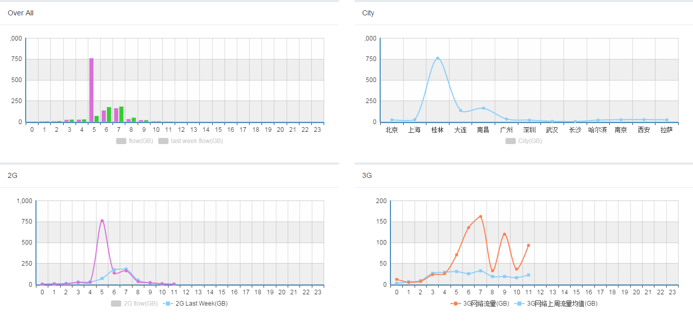

# eCharts for Angular.js
Angular.js directive for [baidu echarts](http://echarts.baidu.com/).

- [angular Demo](./example/index.html)
- [echarts Examples](http://echarts.baidu.com/doc/example-en.html)
- [echarts Documentation](http://echarts.baidu.com/doc/doc-en.html)

## Usage Screenshot



## eCharts Features ##


## Instalation
-**Bower**

The easiest way to install the picker is:
```
bower install iu-echarts --save
```

-**Manual**

This directive depends on [eCharts](https://github.com/ecomfe/echarts) and [Angular](http://angular.org).
Download dependencies above and then use [minified](iu-echarts.min.js) or [normal](iu-echarts.js) version.

## Basic usage
- Declare dependency.

```
App = angular.module('app', ['iu']);
```

- Prepare echarts option in your controller. 

  The option is same as echarts option define: 

```
App.controller('ChartController', function ($scope) {
	$scope.chart = {
      chartOption: {
        version: 1,
        tooltip: {
          trigger: 'axis'
        },
        legend: {
          data: ['Total(MB)'],
          y: 'bottom',
          show:config.type.legend || false
        },
        toolbox: {
          show: false
        },
        grid: {
          x: 60,
          y: 10,
          x2: 10,
          y2: 55
        },
        padding: 0,
        calculable: true,
        xAxis: [
          {
            type: 'category',
            data: ['0', '1', '2', '3', '4', '5', '6', '7', '8', '9', '10', '11', '12']
          }
        ],
        yAxis: [
          {
            type: 'value',
            splitArea: {show: true}
          }
        ],
        series: [
          {
            name: 'Total(MB)',
            type: 'bar',
            data: [2.0, 4.9, 7.0, 23.2, 25.6, 760.7, 135.6, 162.2, 32.6, 20.0, 6.4, 3.3]
          }
        ]
      }
    };
}
```


- Add attribute `data-iu-chart` to HTML and bind it to model.

```
<div data-iu-chart="chart.chartOption"></div>
```


- See `example.html` for demo.

## Advanced usage
- Realtime update chart.

  **Must** set `version` attribute(like {version: 1}} in chartOption.After update data or option,increment version value to update chart.

```
 chart.chartOption.xAxis[0].data = ...;
 chart.chartOption.series[0].data = ...;
 chart.chartOption.version++;
```

- echarts API

Add onRegisterApi function on chartOption to get api interface:
```
$scope.chartApi;
$scope.chart = {
      chartOption: {
 ...
 onRegisterApi: function (api) {
          $scope.chartApi = api;
        }
    }
};
...
// save chart image
$scope.chartApi.saveImage();
```

see example.

- events
```
$scope.chartApi;
$scope.chart = {
      chartOption: {
 ...
 onRegisterApi: function (api) {
          $scope.chartApi = api;
        }
    }
};
...

/*registe events,the second param is the event id array,example:[1,3]
1:CLICK
2:DBLCLICK
3:DATA_ZOOM
4:LEGEND_SELECTED
5:LEGEND_HOVERLINK
6:HOVER
7:MAP_SELECTED
8:PIE_SELECTED
*/
$scope.chartApi.registeEvents($scope,[1,3],function(param){
	if(param.type === 'click'){
}else if(param.type === 'dataZoom'){
}
});

```
see example.

## Author ##
[huke](email:ihuke@126.com)


